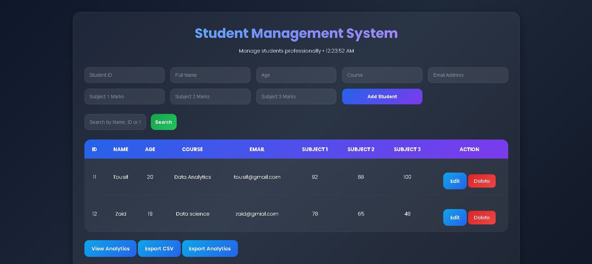
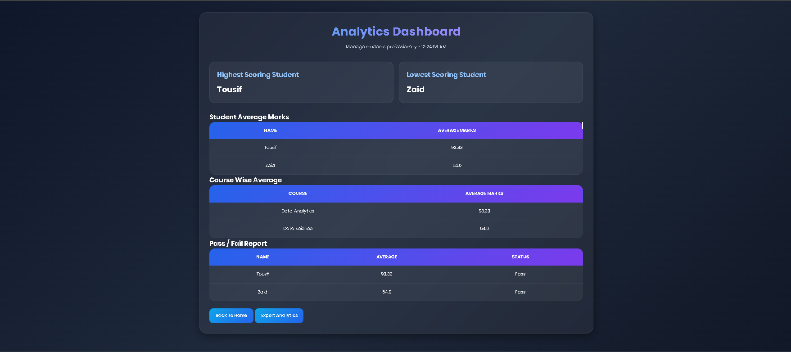

# Student Analytics Dashboard (Flask)


A modern Student Management and Analytics Dashboard built using Flask.


This project allows users to:

- Add students

- Update student details

- Delete students

- Search students

- View analytics

- Export CSV reports

- Export analytics reports


The project follows modular Flask architecture using:

- Blueprints

- Services Layer

- Templates

- Static Files

- JSON File Storage


---


# Features


## Student Management

- Add student records

- Update student details

- Delete students

- Search functionality


## Analytics Dashboard

- Highest scoring student

- Lowest scoring student

- Course-wise average

- Pass/Fail report

- Student average calculation


## Export Features

- Export students CSV report

- Export analytics TXT report


## Frontend

- Responsive UI

- Search bar

- Dynamic student cards

- Analytics dashboard

- Form validation


---


# Technologies Used


- Python

- Flask

- HTML

- CSS

- JavaScript

- Jinja2

- JSON


---


# Project Structure


```bash

project/

│

├── app.py

│

├── data/

│   └── students.json

│

├── exports/

│   ├── students\_report.csv

│   └── analytics\_report.txt

│

├── routes/

│   └── student\_routes.py

│

├── services/

│   ├── file\_service.py

│   ├── student\_service.py

│   └── analytics\_service.py

│

├── static/

│   ├── style.css

│   └── app.js

│

├── templates/

│   ├── students.html

│   ├── analytics.html

│   └── update\_student.html

│

├── requirements.txt

│

└── README.md




